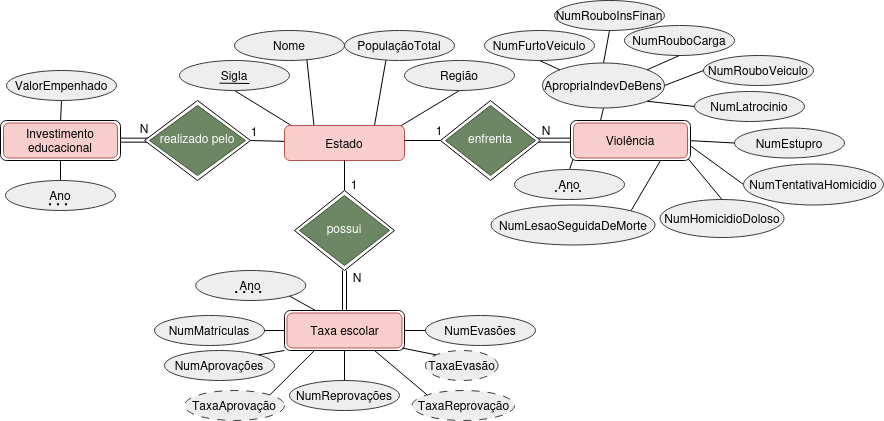

# Projeto Final de IBD: Lei de Acesso a Informação 

Este projeto foi desenvolvido como trabalho final para a disciplina de Introdução a Banco de Dados (IBD) na Universidade Federal de Minas Gerais (UFMG).

- **Disciplina:** Introdução a Banco de Dados
- **Professores:** Clodoveu Augusto Davis Junior
- **Equipe:**
  - Bernardo Zschaber Morato Nogueira 
  - Cauã Neto Santos Pires 
  - Mateus Matsura Teles Costa
  - Pedro Rangel Ferreira de Aguiar 
  - Rafael Junqueira Baracat Silva
  - Renato Vilela de Melo Pacheco 

---

## 1\. Resumo do Trabalho

Foi utilizada da Lei de Acesso a Informação para conseguir dados com o intuito de analisar o fenômeno de investimento público na educação, o impacto desses na evasão escolar, e como esse fato social impacta nos níveis de violência dos estados brasileiros. Para isso, foi utilizado o PostgreSQL para compilar os dados obtidos em tabelas, além disso suas funcionalidades foram usadas em consultas para avaliação das causas e efeitos dos fenõmenos analisados.

### Modelo ER
Utilizado para modelar o banco 

## Dicionário de Dados
Utilizado para garantir a integridade dos dados no banco.

 

---
